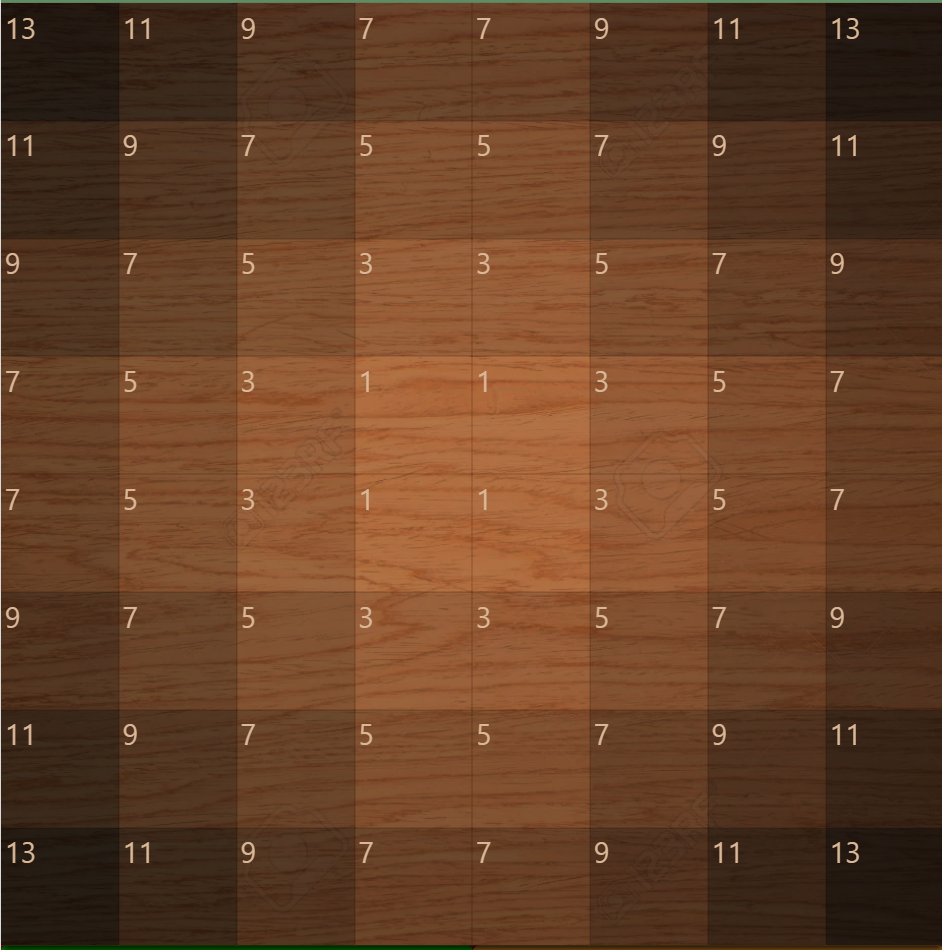
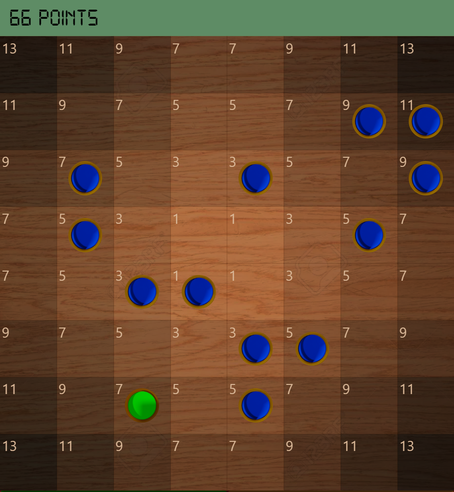
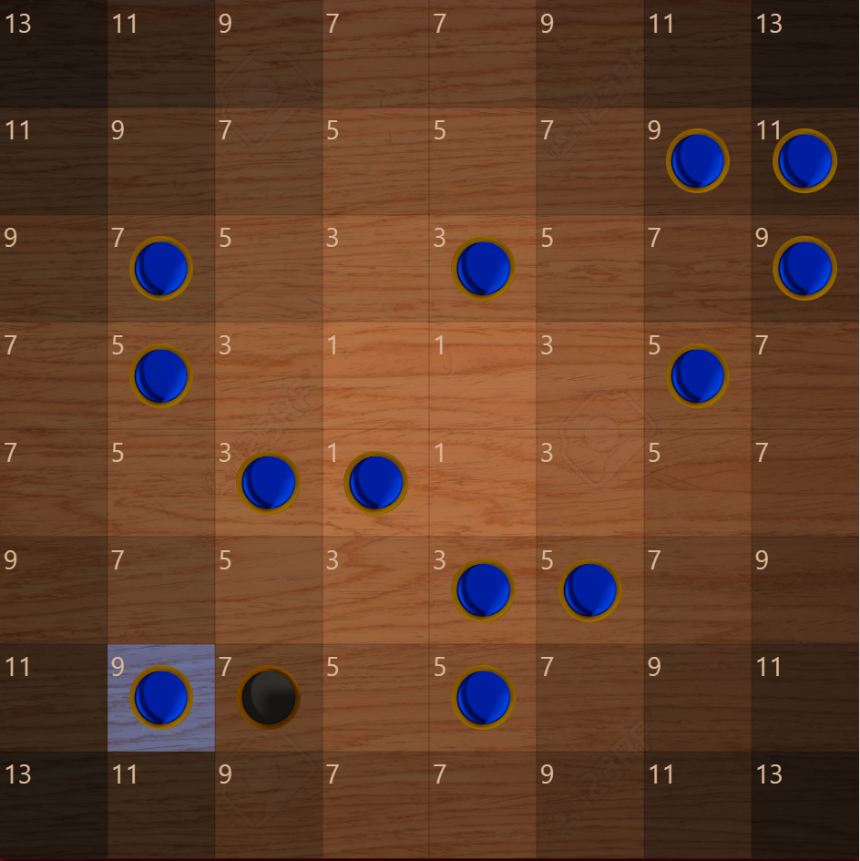
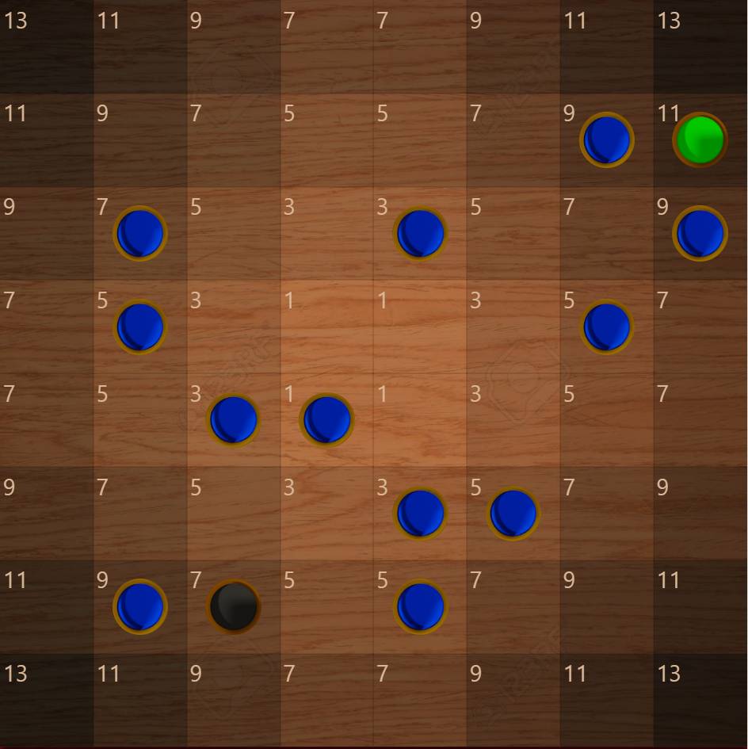
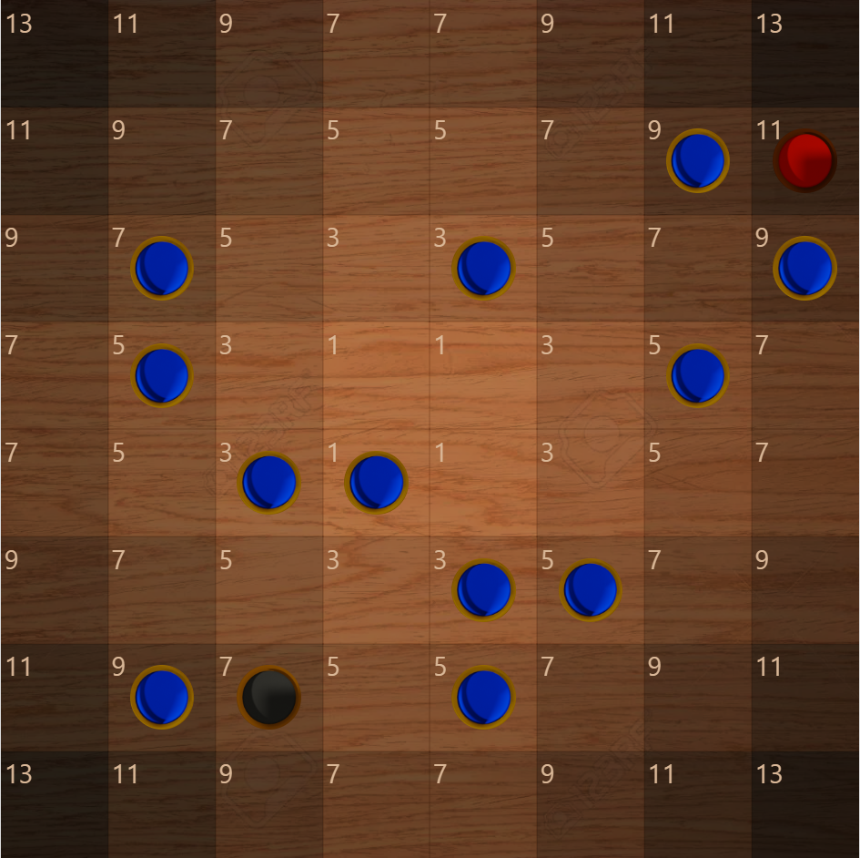
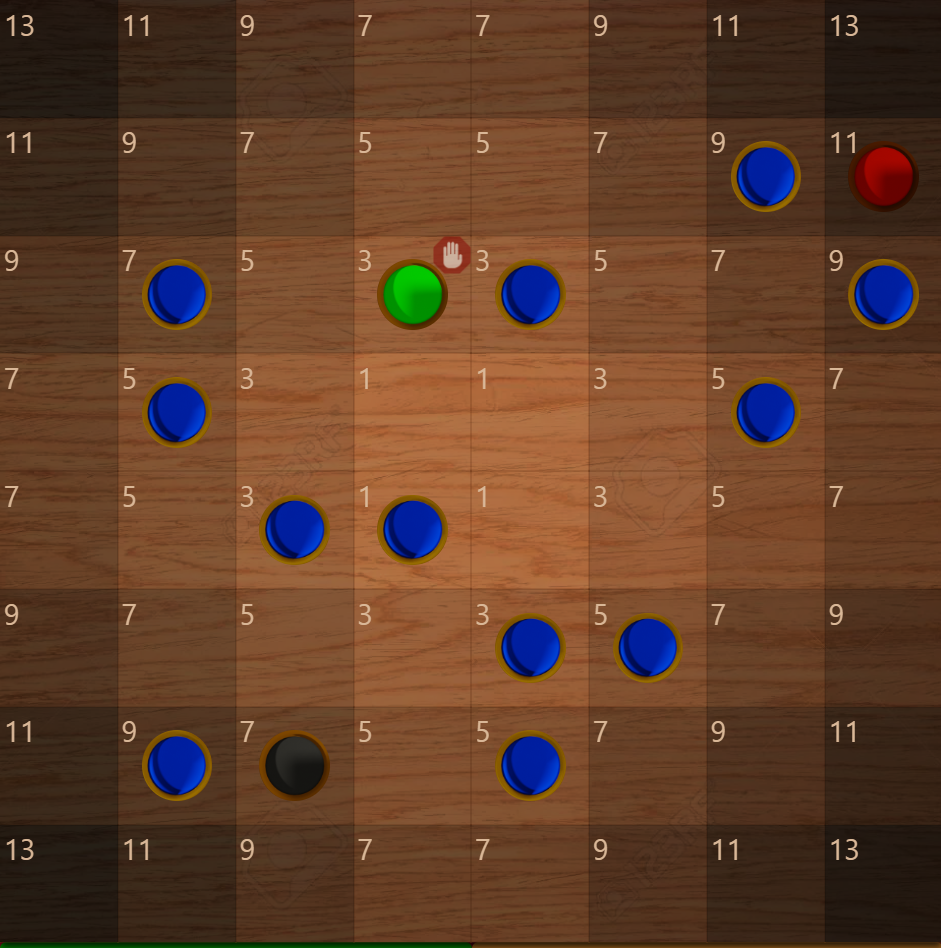
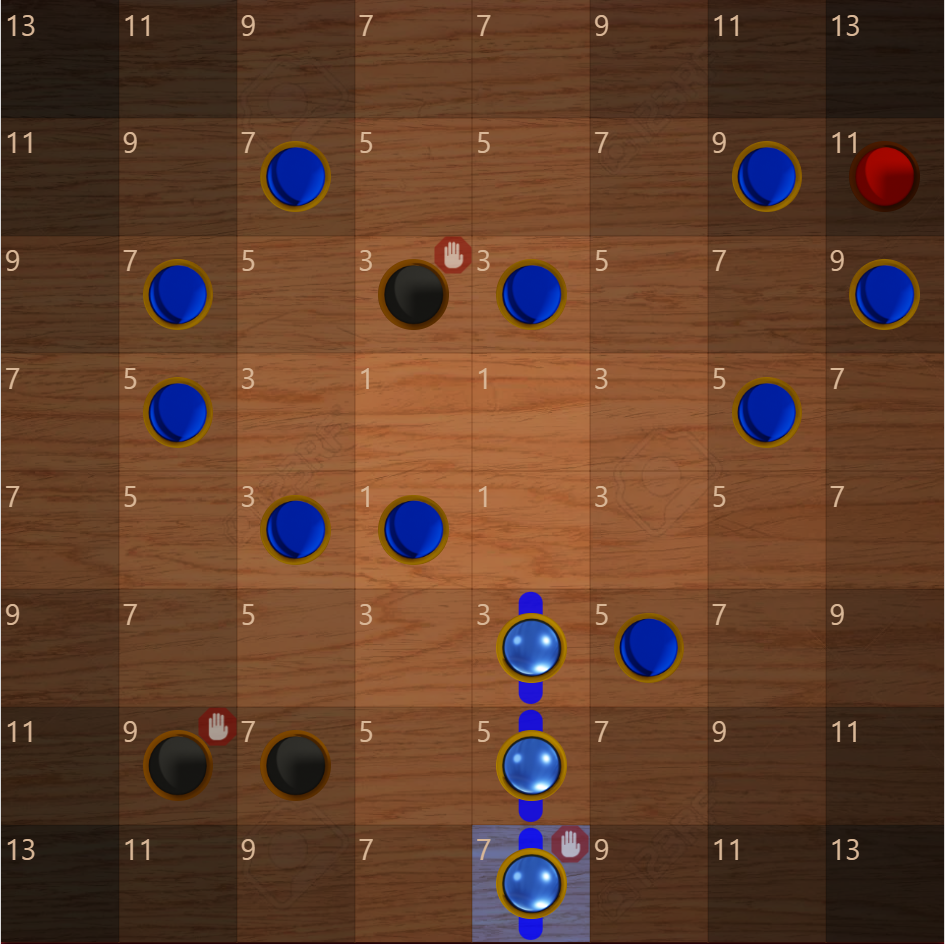
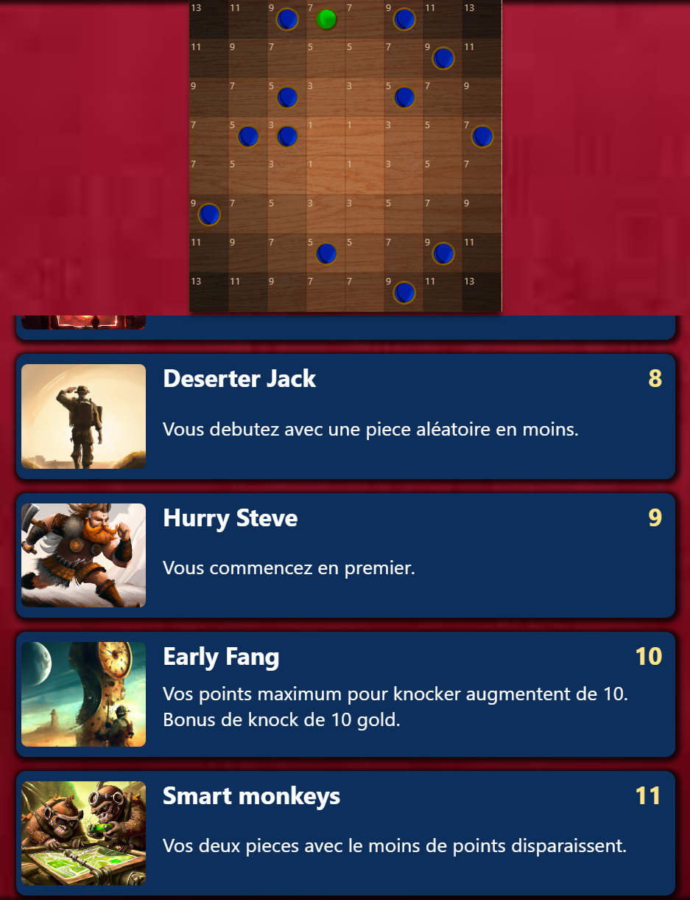

## Le terrain de jeux se compose d'un board de 64 case, chaque case a une certaine valeur en points. 
## Les cases les plus proches du centre ont moins de points.

#
#
#
#

## 12 pieces bleu vous sont distribuées aléatoirement.
## La pièce verte ne vous appartient pas.
## Votre adversaire reçoit lui aussi 12 pièces mais vous ne les voyez pas.
## Chaque pièce ajoute à votre total de points le nombre indiqué sur sa case.
## Ici le total de vos points est de 66
## Le but du jeu est d'avoir le moin de points possible 

#
#
#
#
# Déroulement des tours : 
## Quand c'est à votre tour de jouer, vous avez deux choix : 
## - Soit vous décidez de prendre la pièce verte, elle se transforme donc en bleu
## - Soit vous décidez de transformer une case aléatoire vide en pièce bleu.

# 
# 
#
## Ici la pièce verte ne nous intéresse pas, nous décidons de choisir "PIECE ALÉATOIRE"
## Votre nouvelle pièce apparait avec un fond bleu.
## La piece precedement verte devient noir.
## C'est encore à vous de jouer, maintenant il faut que vous cliquez sur une pièce bleu  pour vous en débarrasser
## Ici nous choisissons la pièce à 11 points en haut à droite.

#
#
#
#
## La pièce que nous avons jeté devient verte, votre adversaire la voie verte également.
## C'est maintenant au tour de l'adversaire de jouer. 
## Comme pour votre tour, il a le choix entre prendre la pièce verte (11) ou une pièce aléatoire.
## Ici il décide de prendre la pièce verte.

#
#
#
#
## Vous connaissez le choix de l'adversaire, si il a choisi la pièce verte, alors vous la voyez maintenant en rouge et vous savez que l'adversaire possède cette pièce.
## Si il avait choisi une piece aleatoire, alors la piece verte serais devenue noir.
## C'est encore au tour de l'adversaire de jouer, il décide de jeter sa pièce à 3 points.

#
#
#
#
## c'est de nouveau à vous de jouer, et la case verte qui vous est proposée est donc celle jetée par l'adversaire.

#
#
#
#
# Alignements
## Quand 3 pièces ou plus sont alignées, elles ne comptent plus dans votre total de points.
## Vous devez donc chercher à en aligner le plus possible

#
#
#
#
# Fin du round. 
## Il existe deux moyens de finir un round. 
## - Soit vous parvenez à aligner toute vos pièces et votre total de points est donc de 0, vous gagnez le round avec un "FULL" 
## - Soit, après avoir choisi la pièce verte ou aléatoire, votre nombre de points est inférieur ou égal à 30 et vous décidez de "knocker" pour mettre fin au round. 

#
#
#
#
# Vainqueur et calcul des gains.

## - Si vous rentrez un FULL, vous gagnez 30 gold + le nombre de points restant de l'adversaire.
### Exemple : vous rentrez le FULL et l'adversaire à encore 15 points sur le board, vous gagnez 45 gold
#
## - Si vous knockez et l'adversaire à plus de point que vous, vous gagnez la différence entre vos points.
### Exemple : vous knockez avec 20 points et votre adversaire à encore 40 points, vous gagnez 20 gold.
#
## - Si vous knockez et l'adversaire a autant ou moins de points que vous, l'adversaire gagne 30 gold + la différence entre vos points.
### exemple : vous knockez avec 30 points, l'adversaire en a 20, il gagne 40 gold.

#

# Le premier joueur à avoir 0 gold ou moins à la fin d'un round perd la partie.

#
#
#
#
# Pouvoirs spéciaux 
## Pour épicer les parties, avant chaque round, vous choisissez 3 pouvoirs qui changeront certaines règles.
## Chaque pouvoir vous coûte un prix en gold.

