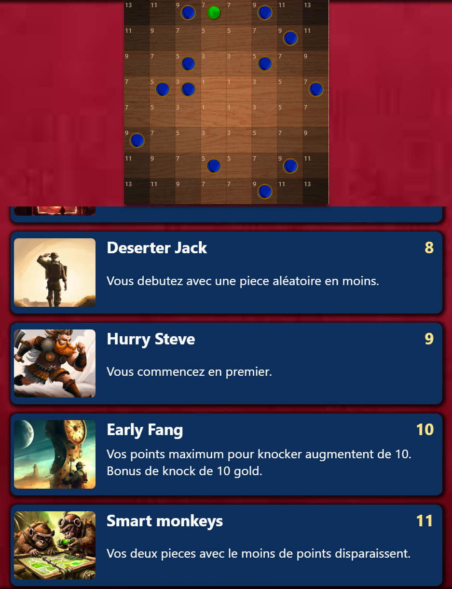
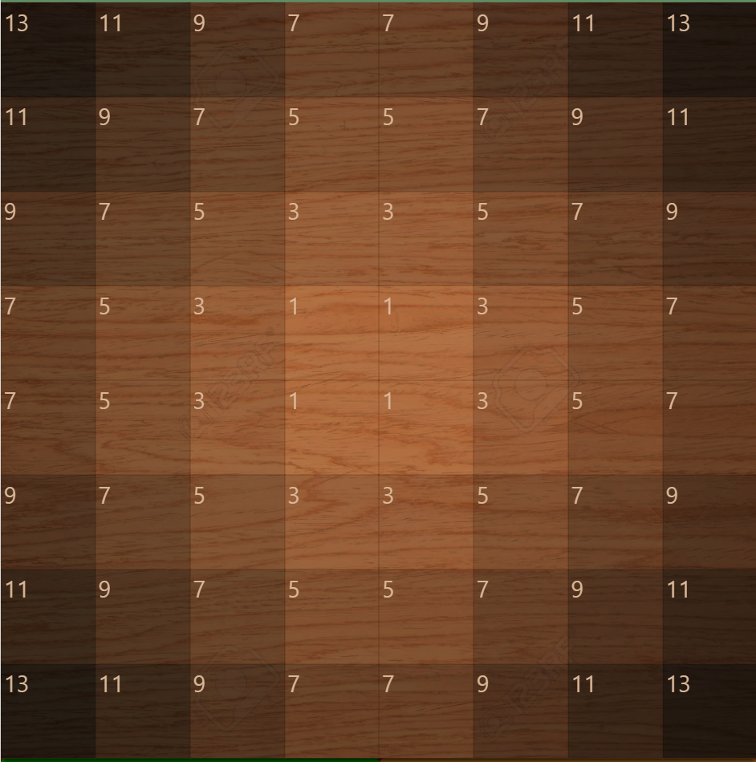
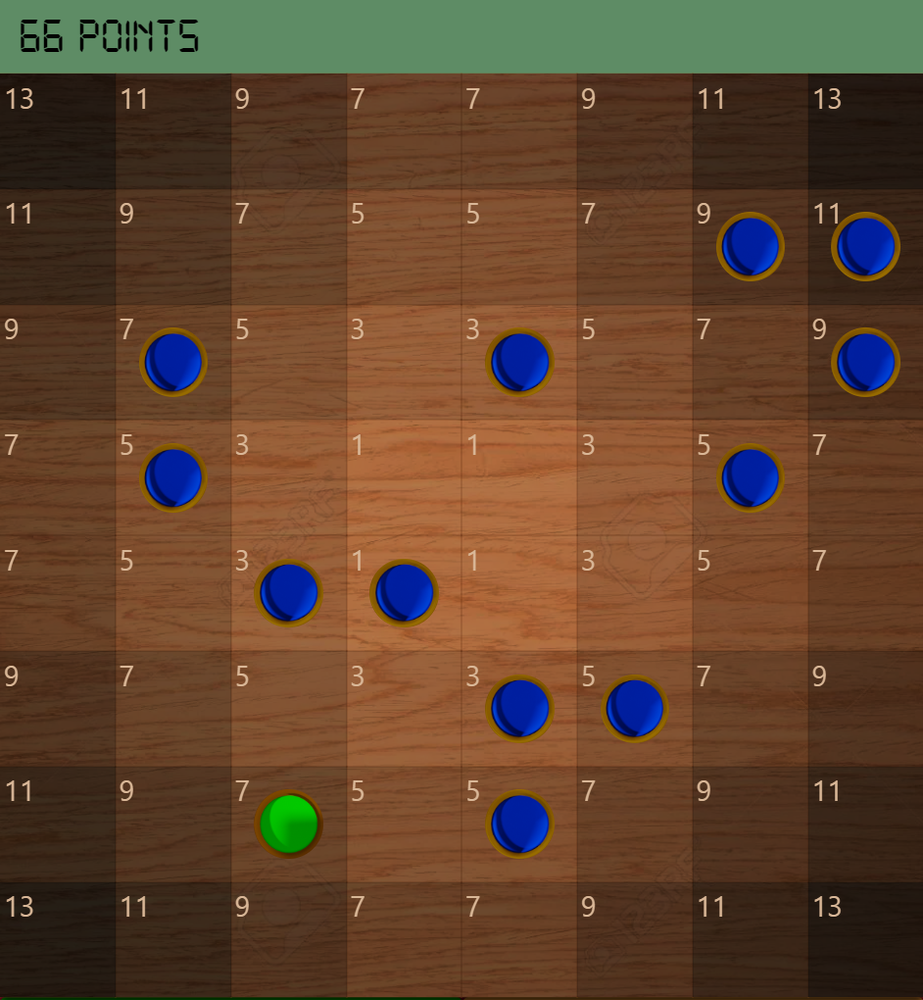
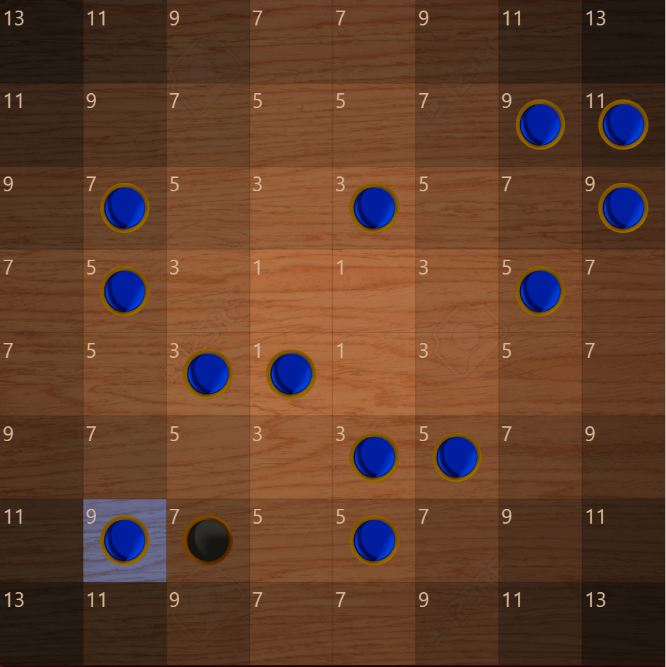
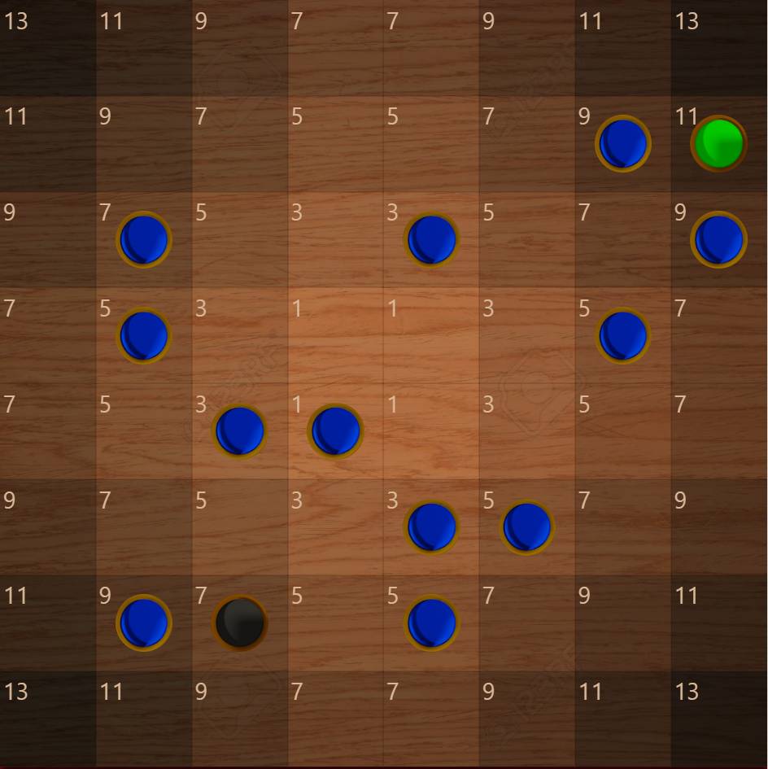
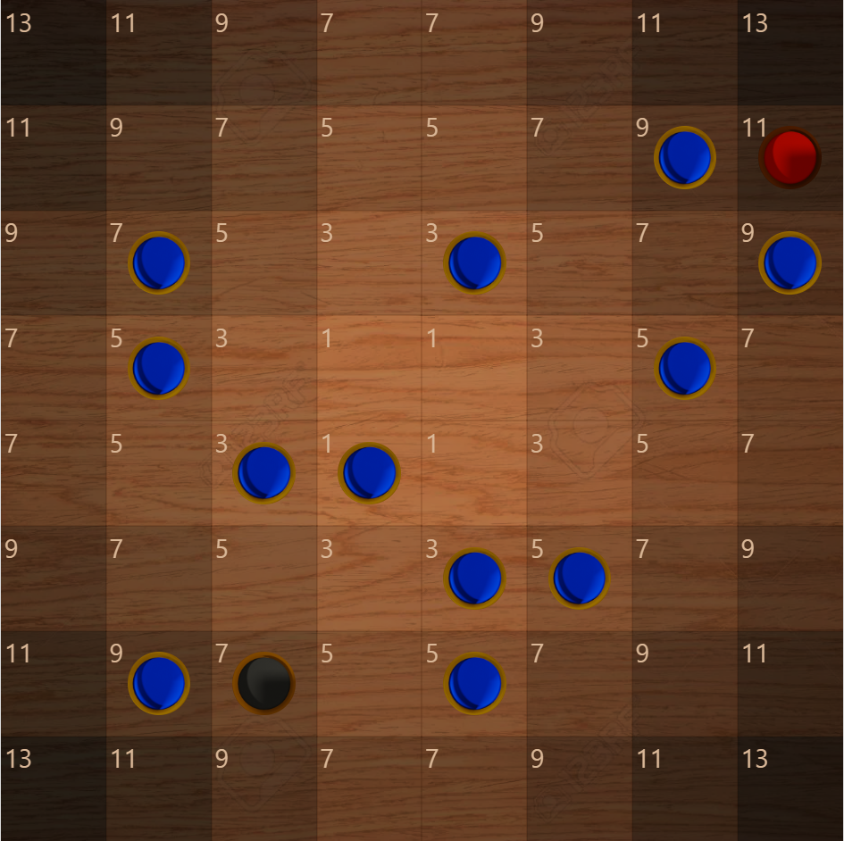
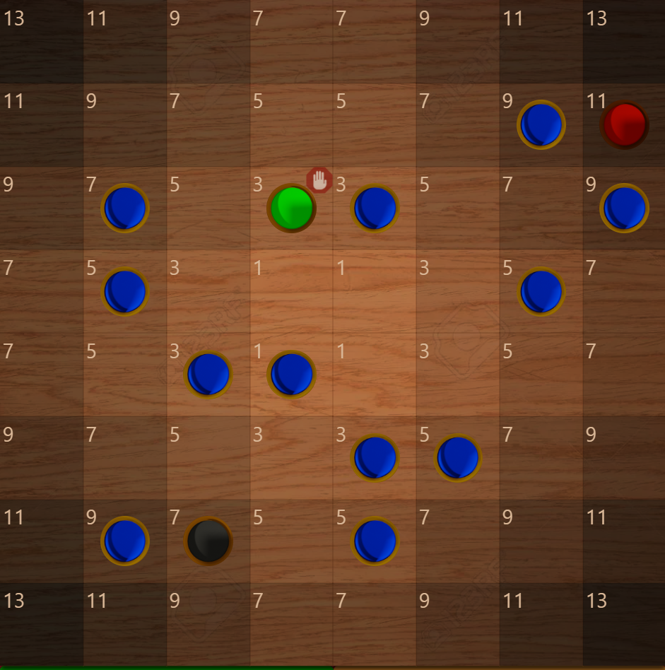
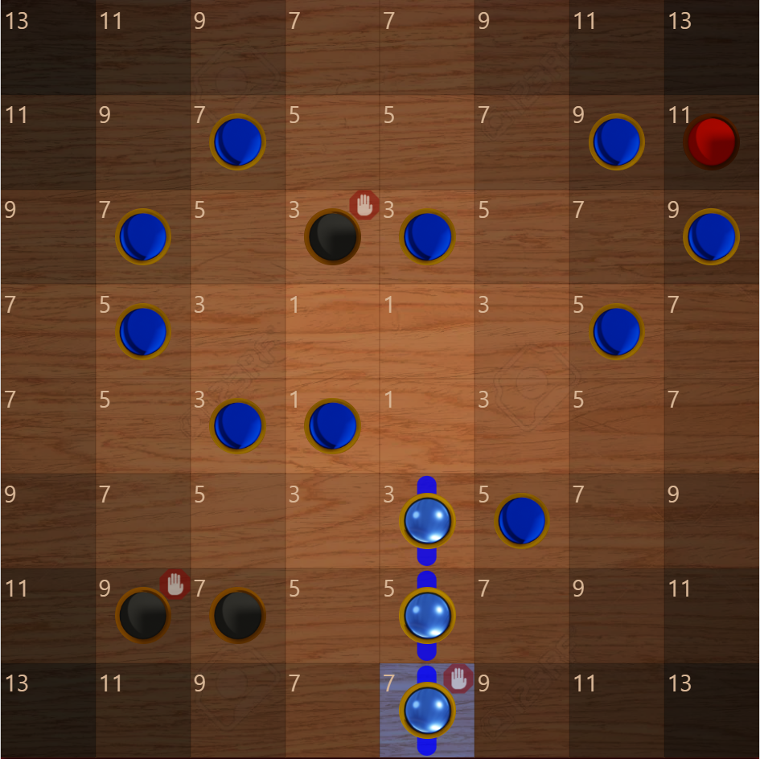

# Start of the game
## To spice up the game, before each round, you choose 3 powers that will change some rules.
## Each power costs you a gold price.
## If you are new to the game, you can pick 3 time the first power "Lucien"

#
#
#
#
## The playing field consists of a 64 square board, each square has a certain point value. 
## The squares closer to the center have fewer points.

#
#
#
#

## 12 blue pieces are randomly distributed to you.
## The green piece does not belong to you.
## Your opponent also receives 12 pieces but you do not see them.
## Each piece adds to your point total the number shown on its square.
## Here your total points are 66.
## The object of the game is to get as few points as possible.

#
#
#
#
# Turns are played : 
## When it's your turn to play, you have two choices: 
## - Either you decide to take the green piece, so it turns into blue
## - Or you decide to turn an empty random square into a blue piece.

# 
# 
#
## Here the green piece does not interest us, we decide to choose "RANDOM PIECE".
## Your new piece appears with a blue background.
## The previous green piece becomes black.
## It's your turn again, now you have to click on a blue piece to get rid of it
## Here we will choose the 11 point piece in the top right corner.

#
#
#
#
## The piece we threw away turns green, your opponent see it green too.
## Now it's your opponent's turn to play. 
## As with your turn, he has the choice of taking the green piece (11) or a random piece.
## Here he decides to take the green piece.

#
#
#
#
## You know the opponent's choice, if he chose the green piece, then you now see it as red and know that the opponent has that piece.
## If he had chosen a random piece, then the green piece would have become black.
## It's the opponent's turn again, he decides to throw his 3-point piece.

#
#
#
#
## it's your turn again, and the green square you are offered is the one thrown by the opponent.

#
#
#
#
# Alignments
## When 3 or more pieces are lined up, they no longer count toward your point total.
## So you must try to line up as many as possible.

#
#
#
#
# End of the round. 
## There are two ways to finish a round. 
## - Either you manage to align all your pieces and your total of points is thus 0, you win the round with a "FULL". 
## - Or, after having chosen the green or random piece, your number of points is lower or equal to 30 and you decide to "knock" to end the round. 

#
#
#
#
# Winner and winnings calculation.

## - If you hit a FULL, you win 30 gold + your opponent's remaining points.
### Example: You hit a FULL and the opponent has 15 points left on the board, you win 45 gold
#
## If you knuckle and the opponent has more points than you, you win the difference between your points.
### Example: You knuckle with 20 points and your opponent has 40 points left, you win 20 gold.
#
## If you knocke and the opponent has as many or less points than you, the opponent wins 30 gold + the difference between your points.
### example: you knocke with 30 points, the opponent has 20 points, he wins 40 gold.

#

# The first player to have 0 gold or less at the end of a round loses the game.